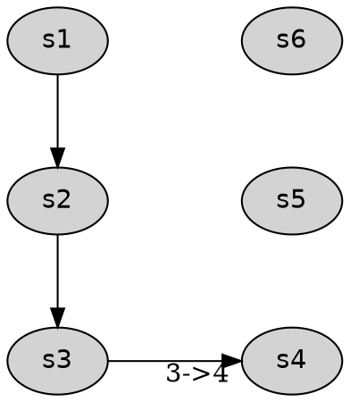

# SPPM Layout Enhancement Spec (Draft)

Status: Updated for pre-1.0 implementation
Scope: shared DOT autoformat controls plus SPPM-specific text/density controls

## 1. Goals

Improve readability across sequence-oriented DOT renderers while preserving
SPPM-specific analytical detail.

This proposal adds:

- FLO-level layout width controls
- Automatic row wrapping for long linear left-to-right flows
- Label density modes
- Per-field text handling controls
- Output profile presets for publishing targets

## 2. Non-goals

- Non-DOT exports (`json`, `ingredients`, `movement`) remain unchanged.
- SPPM-only label density and text policies remain renderer-specific.
- Spaghetti rendering remains outside shared wrap planning for now.

## 3. Terminology

- Autoformat: shared wrapping/packing controls for sequence-oriented DOT renderers.
- SPPM: Standard Process Performance Map (`--diagram sppm`).
- Row wrapping: splitting a long left-to-right chain into multiple horizontal rows.
- Width estimate: renderer-side predicted width based on node count, spacing, and label metrics.

## 4. User-facing API

## 4.1 CLI flags

All flags below are DOT-only render options and must follow existing usage error
behavior for non-DOT exports.

- `--layout-max-width-px <int>`
- `--layout-target-columns <int>`
- `--layout-wrap {auto,off}`
- `--sppm-step-numbering {off,node,edge}`
- `--sppm-label-density {full,compact,teaching}`
- `--sppm-wrap-strategy {word,balanced,hard}`
- `--sppm-truncation-policy {ellipsis,clip,none}`
- `--sppm-max-label-step-name <int>`
- `--sppm-max-label-workers <int>`
- `--sppm-max-label-ctwt <int>`
- `--sppm-output-profile {book,web,print,slide}`

Notes:

- `max_width_px` and `target_columns` are both optional. If both are provided,
  wrapping triggers when either threshold is exceeded.
- `sppm-output-profile` is independent of existing `--profile` (projection profile)
  and `--sppm-theme` (color theme).

## 4.2 diagrams.toml keys (proposed)

`diagrams.toml` is optional. CLI flags override config values.

```toml
[sppm]
max_width_px = 1400
target_columns = 8
wrap_layout = "auto"  # legacy alias: wrap_rows
step_numbering = "off"
label_density = "full"
output_profile = "book"

[sppm.text]
wrap_strategy = "balanced"
truncation_policy = "ellipsis"

[sppm.text.max_label]
step_name = 48
workers = 28
ctwt = 20

[sppm.presets.book]
orientation = "lr"
max_width_px = 1200
target_columns = 6
label_density = "compact"
node_font_pt = 10
info_font_pt = 8
nodesep = 0.7
ranksep = 1.0

[sppm.presets.web]
orientation = "lr"
max_width_px = 1800
target_columns = 10
label_density = "full"
node_font_pt = 11
info_font_pt = 9
nodesep = 0.9
ranksep = 1.2

[sppm.presets.print]
orientation = "tb"
max_width_px = 1000
target_columns = 5
label_density = "teaching"
node_font_pt = 9
info_font_pt = 8
nodesep = 0.6
ranksep = 0.9

[sppm.presets.slide]
orientation = "lr"
max_width_px = 2200
target_columns = 12
label_density = "compact"
node_font_pt = 13
info_font_pt = 10
nodesep = 1.0
ranksep = 1.3
```

## 5. Rendering behavior

## 5.1 Width controls

Applies for both orientations:

- Compute dominant-axis estimate from:
  - estimated node dimensions (header + info rows)
  - spacing (`nodesep`, `ranksep`)
  - connector/edge label allowance
- If estimate exceeds `max_width_px`, wrapping is eligible.
- If linear depth exceeds `target_columns`, wrapping is eligible.

Orientation semantics:

- `rankdir=LR`: wrap into additional rows (snake down).
- `rankdir=TB`: wrap into additional columns (snake right).

## 5.2 Automatic row/column wrapping

When `layout-wrap=auto` and eligibility is true:

- Partition dominant linear path into chunks along the orientation axis.
- Preserve reading order inside each chunk according to orientation.
- Route connectors between chunks using orthogonal-like routing
  (`splines=ortho` preferred when compatible, otherwise default splines).
- Add hidden ranking constraints to keep chunk ordering deterministic.

LR behavior (snake down):

- Each row reads left-to-right.
- Connector routes from row end to next row start.

TB behavior (snake right):

- Each column reads top-to-bottom.
- Connector routes from column end to next column start.

Recommended chunking heuristic (v1):

- `row_size = min(target_columns, max(3, floor(max_width_px / avg_node_px)))`
- If only one control is set, derive row size from that control.

## 5.3 Sequence clarity and numbering

`--sppm-step-numbering` behavior:

- `off`: no numbering markup.
- `node`: prefix step header text with `N.` (for example `7. Dry`).
- `edge`: add edge labels `N->N+1` on primary path connectors only.

Numbering should be deterministic using topological walk from `start` with stable
secondary sort by node id.

## 5.4 Label density modes

Density impacts visible text, not source IR data.

- `full` (current-equivalent):
  - step title
  - description (if present)
  - CT
  - WT
  - workers
  - optional notes (`--show-notes`)

- `compact`:
  - step title
  - CT + WT in condensed line
  - workers abbreviated (initials or capped token list)
  - omit description by default

- `teaching`:
  - step title
  - one key metric line (CT preferred, else WT)
  - omit workers and description by default

## 5.5 Text handling controls

Apply in this order per field:

1. field-level normalization (whitespace collapse)
2. wrapping (`word`, `balanced`, `hard`)
3. max length enforcement
4. truncation policy (`ellipsis`, `clip`, `none`)

Per-field caps:

- `step_name`
- `workers`
- `ctwt`

Defaults are profile-driven and can be overridden by CLI/config.

## 5.6 Output profile presets

Preset resolution order:

1. Built-in preset defaults (`book`, `web`, `print`, `slide`)
2. `diagrams.toml` preset overrides
3. explicit `sppm` keys in `diagrams.toml`
4. CLI flags

Preset knobs include:

- orientation
- spacing (`nodesep`, `ranksep`)
- font sizing (`node_font_pt`, `info_font_pt`)
- width/wrapping defaults
- label density

## 6. Expected DOT characteristics

Generated DOT should reflect these behaviors:

- graph attrs vary by resolved profile (`nodesep`, `ranksep`, optional `splines=ortho`)
- wrapped rows use deterministic ranking groups and connector edges
- node labels preserve current HTML-table style, with content filtered by density mode
- step numbering appears in node header or selected edge labels based on mode

Minimal examples:



## 6.1 Wrapped SPPM SVG boundary interception

Implementation note for wrapped LR SPPM boundary transitions:

- DOT remains the canonical logical route contract (ports, boundary edges,
  and deterministic metadata).
- Final visual geometry for wrapped boundary doglegs is normalized in SVG
  postprocessing for `--render-to *.svg` / build artifacts.

Rationale:

- Graphviz orthogonal routing can still emit visually incorrect boundary
  approaches (for example, side-biased or mid-box-feeling landings) even when
  DOT routing metadata is deterministic.
- The product requirement for wrapped SPPM boundary edges is a strict,
  repeatable dogleg shape and centered top-entry drop on the target node.

Guardrails:

- Rewrite scope is intentionally narrow: wrapped LR SPPM boundary edges only.
- Non-SPPM, non-wrapped, and non-boundary edges are not modified.

## 7. Validation and errors

Validation rules:

- numeric controls (`max_width_px`, `target_columns`, max-label lengths) must be > 0
- unknown enum values fail as usage error code `1`
- DOT-only enforcement mirrors existing render option contract

Recommended error text style:

- `Render option --layout-max-width-px requires DOT output`
- `Invalid value for --sppm-label-density: expected full|compact|teaching`

## 8. Backward compatibility

- Default behavior remains unchanged when new options are not provided.
- Existing SPPM theme behavior remains unchanged.
- Existing render/profile/detail options continue to function as-is.

## 9. Implementation plan (incremental)

Phase A: Option plumbing

- Extend `RenderOptions` with new SPPM controls.
- Add CLI parser and Click shims.
- Extend DOT-only option gating and docs.

Phase B: Label density + text handling

- Add label transformation helpers in SPPM renderer.
- Add unit tests for each density mode and truncation path.

Phase C: Width estimate + orientation-aware wrapping

- Add wrapping planner for LR (snake down) and TB (snake right).
- Add deterministic connector routing strategy.
- Add tests for chunking thresholds and numbering stability.

Phase D: Presets + diagrams.toml

- Add config loader and precedence merge.
- Add preset conformance tests and user manual examples.

Implementation note (current status):

- Shared autoformat controls are now used by SPPM, flowchart, and swimlane.
- The width estimator is still heuristic in Phase 1 and will be improved in Phase 2.
- Rework styling is implemented as dashed edges; routing polish remains Phase 2/3 work.

## 10. Acceptance criteria

- Long LR SPPM diagrams can wrap into multiple rows with deterministic ordering.
- Long TB SPPM diagrams can wrap into multiple columns with deterministic ordering.
- At least one profile (`book`) demonstrably reduces page overflow versus baseline.
- `compact` and `teaching` reduce label payload while preserving process sequence.
- Text controls prevent unreadable tiny-font squeeze under width constraints.
- Existing SPPM output is unchanged when no new flags/config are used.
