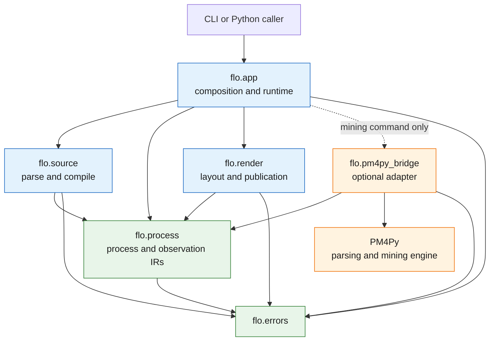

# ADR: Simplified Package Architecture And PM4Py Boundary

Status: accepted

Supersedes: `package_dependency_direction.md`

Refines: `observed_event_mining.md`

## Context

FLO currently has seven top-level packages under `src/flo`: `adapters`,
`compiler`, `core`, `export`, `render`, `schema`, and `services`. Most product
behavior is concentrated in `compiler`, `core`, and `render`; the remaining
packages are small boundaries whose names and separation add navigation and
dependency-policy cost without yet isolating independently evolving products.

The superseded package-direction ADR proposed approximately ten target layers.
That design protected dependency direction, but it turned conceptual seams into
packages before FLO had enough implementation pressure to justify them.

FLO also intends to ingest event logs and later support process discovery and
conformance. PM4Py already implements XES and OCEL ingestion, process discovery,
and conformance algorithms. Reimplementing those facilities would duplicate a
specialized dependency and blur ownership between FLO's language and publishing
work and a process-mining engine.

## Decision

FLO will converge on four substantive internal packages plus two leaf modules:

- `flo.process`: stable process-domain contracts, including canonical ProcessIR,
  ObservedEventIR, semantic validation, static process analysis, schema
  projection, and serialization
- `flo.source`: `.flo` and YAML parsing, include resolution, source diagnostics,
  and compilation into `flo.process` values
- `flo.render`: renderer-neutral projection, layout, SVG generation,
  publication composition, and themes, separated internally where useful but
  retained as one top-level subsystem
- `flo.app`: CLI commands, configuration, use-case orchestration, file I/O,
  logging, and telemetry
- `flo.errors`: architecture-neutral error contracts
- `flo.pm4py_bridge`: the single optional PM4Py integration boundary

No additional top-level package is introduced merely to represent a conceptual
layer. A new package requires demonstrated independent ownership, dependency,
or release pressure that cannot be expressed clearly as a module within one of
these packages.

## Import Direction

Arrows mean "may import." Absence of an arrow means the import is forbidden.
In particular:

- `process` imports none of `source`, `render`, `app`, or `pm4py_bridge`
- `source` and `render` are peers and do not import one another
- `render` never imports PM4Py or mining implementations
- `pm4py_bridge` imports `process` and PM4Py, but not `source`, `render`, or `app`
- `app` is the composition root and is the only package that coordinates all
  product capabilities

## PM4Py Ownership Boundary

PM4Py owns supported event-log decoding and mining algorithms. FLO owns:

- explicit CSV mapping and other user-facing import choices
- stable ProcessIR and ObservedEventIR contracts
- normalization from PM4Py values into those contracts
- deterministic identity, provenance, diagnostics, and reproducibility data
- Lean-specific semantics and static analysis
- conversion of supported mining results into candidate ProcessIR
- deterministic diagrams and publication artifacts

PM4Py DataFrames, EventLog values, OCEL values, Petri nets, process trees, and
algorithm result dictionaries do not cross the bridge. Every conversion that
can lose meaning returns explicit fidelity diagnostics and may refuse an
unsupported conversion. Discovery never silently promotes a candidate into
authored process truth.

PM4Py is an optional dependency group and is imported lazily by the bridge.
Installing core FLO must not install PM4Py, pandas, or other mining dependencies.
FLO will not introduce a generic mining-provider framework before a second real
provider requires one.

Before model-based conformance is implemented, FLO must define the supported
formal conversion of decisions, parallel flow, subprocesses, rework, and other
language semantics into PM4Py model types. An unsupported or ambiguous semantic
conversion fails explicitly rather than using a visually similar graph.

## Enforcement

CI enforces both the migration state and the target state:

1. Import Linter keeps recursive sibling-cycle detection enabled.
2. Each target package receives explicit forbidden-import contracts in the same
   change that creates it; a move is not complete while its inward dependencies
   are enforced only by convention.
3. The private-import policy forbids importing another top-level package's
   underscore-prefixed implementation modules.
4. An AST policy test permits direct `pm4py` imports only from
   `flo.pm4py_bridge` and rejects PM4Py as a core runtime dependency.
5. The ordinary clean-wheel smoke job installs core FLO without mining
   dependencies, imports every core module, and starts the CLI.
6. A future mining job installs the optional dependency group and runs bridge
   normalization, fidelity, discovery, and conformance contract tests.
7. Existing renderer-neutral and layout-to-SVG boundary tests remain in force
   inside the consolidated `render` package.

During migration, current-package Import Linter contracts remain active. They
are replaced, not broadly exempted, as modules move. Compatibility facades are
allowed only for documented public imports and may not become dependencies of
new internal code.

## Migration

Implementation status (2026-08-29): steps 1–5 are complete. The checked-in
substantive packages are `flo.process`, `flo.source`, `flo.render`, and
`flo.app`, with `flo.errors` as a leaf module. Transitional packages and the
unused duplicate `flo.pipeline` orchestration path have been removed. Step 6
remains intentionally deferred until the first mining slice; no empty
`flo.pm4py_bridge` package is created in advance of that pressure.

The intended sequence is:

1. Move the architecture-neutral error implementation to `flo.errors` and make
   old service imports temporary compatibility aliases.
2. Form `flo.process` from compiler IR, validation, analysis, schema helpers, and
   serialization/export code.
3. Form `flo.source` from current adapters, compilation, and source diagnostics.
4. Consolidate current `core` and remaining `services` code into `flo.app`.
5. Restructure `flo.render` internally without creating top-level `diagram` or
   `publish` packages.
6. Add `flo.pm4py_bridge` only with the first implemented mining slice.
7. Remove transitional packages and compatibility aliases before the public
   Python API freeze.

Each step is independently testable and must leave all architecture and wheel
smoke gates green.

## Consequences

The package tree describes implemented product responsibilities instead of an
aspirational layer catalog. FLO retains hard dependency-direction enforcement
with fewer names, facades, and cross-package seams. Rendering remains large but
honestly represented as the product's main technical subsystem.

The optional bridge lets FLO use PM4Py without allowing PM4Py types or dependency
weight to define FLO's semantic model or publishing APIs. The cost is an
explicit normalization and fidelity boundary, plus a required formal-semantics
decision before model-based conformance work begins.
