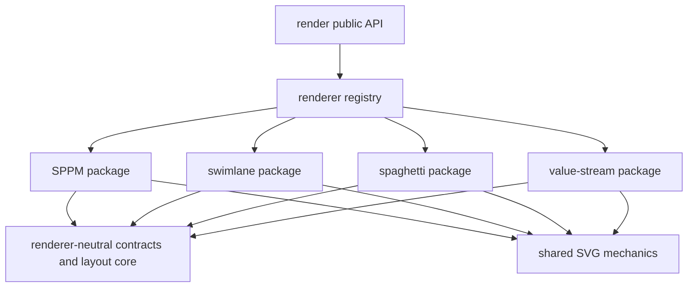

# Renderer Architecture Boundaries

Status: accepted

## Purpose

Keep SPPM, swimlane, spaghetti, and value stream as four independent
renderers while allowing them to consume a small renderer-neutral platform.

## Package map

Each diagram owns an explicit package and artifact entrypoint:

- `src/flo/render/sppm/`
- `src/flo/render/swimlane/`
- `src/flo/render/spaghetti/`
- `src/flo/render/value_stream/`

SPPM and swimlane also own their ELK request builders in `layout.py`. Shared
ELK code accepts measured node sizes and edge decorations through callbacks;
it does not import a renderer package. Spaghetti and value stream own their
direct spatial projection and SVG emission end to end.

Renderer-neutral infrastructure consists of:

- artifact and diagnostic contracts
- resolved render options and themes
- `src/flo/render/shared/` for truly shared SVG mechanics
- `src/flo/render/layout_core/` for layout contracts, execution,
  normalization, placement, routing, and geometry
- `src/flo/render/registry.py` for executable registration and dispatch

`src/flo/render/capability_matrix.py` is a compatibility view generated from
the executable registry; it is not a second registration table.

## Dependency direction

The arrows do not run back from shared code to renderer packages, and renderer
packages do not import one another. Swimlane therefore owns its shapes and
edges rather than inheriting SPPM presentation behavior.

## Ownership rules

1. Put behavior in a renderer package when its semantics or visual convention
   belongs to one diagram family.
2. Put code in `shared/` only when it is renderer-neutral and already useful
   across diagram families.
3. Keep layout contracts and execution in `layout_core/`; inject
   renderer-owned measurement and decoration policy through narrow callbacks.
4. Register each supported diagram/backend pair once in `registry.py`.
5. Do not preprocess canonical IR globally for renderer convenience. A
   renderer-specific projection belongs inside that renderer.
6. Do not restore flat `_svg_*`, `_sppm_*`, backend-selector, Graphviz, or DOT
   renderer modules.

## Enforcement

- Import Linter forbids shared-to-renderer and renderer-to-renderer imports and
  checks sibling cycles recursively.
- `tests/policy/test_renderer_architecture_boundaries.py` requires all four
  package entrypoints, rejects legacy flat modules, and rejects global render
  preprocessing.
- Focused artifact and layout tests prove SPPM and swimlane retain independent
  behavior across the shared ELK seam.

## References

- `docs/design/renderers/sppm.md`
- `docs/design/renderers/swimlane.md`
- `docs/design/renderers/spaghetti.md`
- `docs/design/renderers/value_stream.md`
- `docs/design/adr/render_stack_elk_svg_typst.md`
- `docs/design/adr/simplified_package_architecture.md`
